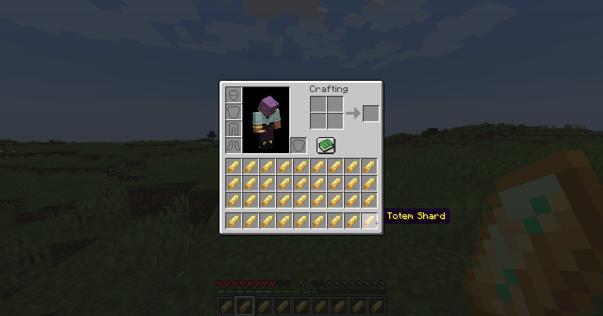
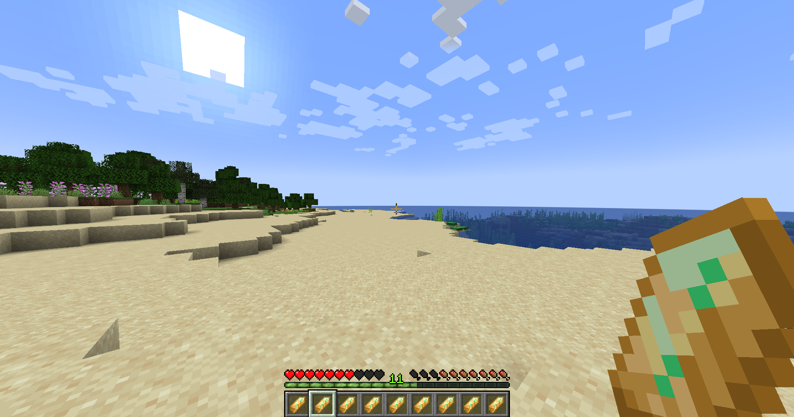
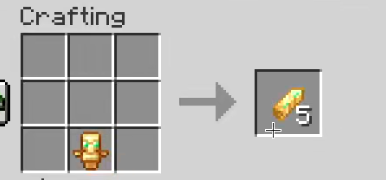
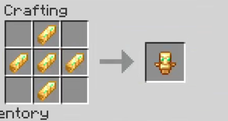
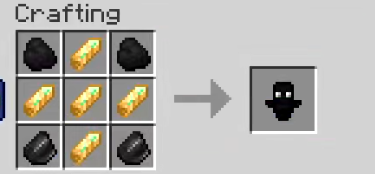
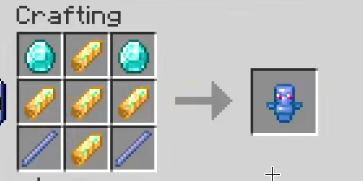
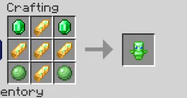
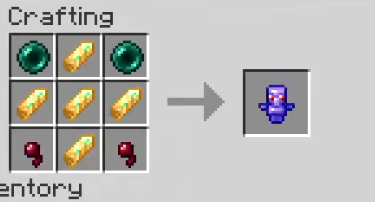
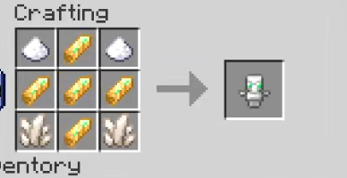

# Variety of Totems
This mod adds a variety of totems that have special abilities that are activated on death.

# NOTE FOR GITHUB:
The releases tab isn't reliably updated by me, so please download the jar file on Modrinth. 
[Modrinth Download Page](https://modrinth.com/mod/variety-of-totems)

## 🧤 Items

- ### ⚡ Totem Shard
This is the main item used to craft totems. 
A Vex, Ravager, Ender Dragon, and Warden now drop Totem Shards.

📸 Screenshots

# As of version 1.3.0, all effects and effect lengths are configurable.

- ### 🌳 Green Totem
This totem gives Hero of the Village for 5 minutes, Luck for 7.5 minutes, Nausea for 25 seconds, Oozing for 15 seconds, and Poison for 5 seconds. 
This totem's ability is spawning slime blocks below you in a 3x3 grid, flinging you in the air.

📽️ Video

- ### 💎 Blue Totem
This totem gives Absorption for 50 seconds, Bad Omen for 100 seconds, Conduit Power for 45 seconds, Dolphins Grace for 45 seconds,
Jump Boost for 5 seconds, Night Vision for 35 seconds, Trial Omen for 7.5 minutes, and Water Breathing for 20 seconds. 
This totem's ability is giving you low durability diamond armor in the best possible slot that doesn't have armor.

🤔 Explanation

The totem will check in this order if you have armor equipped in that slot. 
Chestplate → Leggings → Helmet → Boots.

If you don't have armor in any of these slots, it will give you armor in that slot. 
Once it has given you armor, it won't give you any more armor. (If you don't have armor in your chestplate slot, it will put that armor in the slot, and won't give you anything else.)

- ### 🪻 Purple Totem
This totem gives Speed for 200 seconds, Haste for 100 seconds, and Strength for 50 seconds. 
This totem's ability is teleporting you 10 seconds into the past.

📽️ Video

- ### 🐦‍⬛ Black Totem
This totem gives Darkness for 10 seconds, Glowing for 200 seconds, Infested for 200 seconds, and Slowness for 7.5 seconds. 
This totem's ability is killing up to 5 hostile mobs in a 20 block radius.

📽️ Video

- ### 🐻‍❄️ White Totem
This totem gives Glowing for 20 seconds, Invisibility for 40 seconds, Strength for 25 seconds, and Slow Falling for 20 seconds. 
This totem's ability is putting you in spectator mode for 5 seconds.

📽️ Video

## 🏗️ Crafting Recipes

Recipes

 
 
 
 
 
 

## 📄 NOTES:

### 🐦‍⬛ Black Totem
Just note that the black totem's kill radius is 20x20x20 so if you're right below a cave, those entities could die as well.
### 👷Versions
Any older version of the mod is not maintained by me. Any and all bugs/features will be added in newer Minecraft versions.
### 📜 Dependencies
**The fabric api is required.** 
McQoy is an optional dependency that allows you to edit the config via a Gui (only for the client/single player). 
QoMC is another optional dependency that allows you to edit the config via commands (mainly for servers).